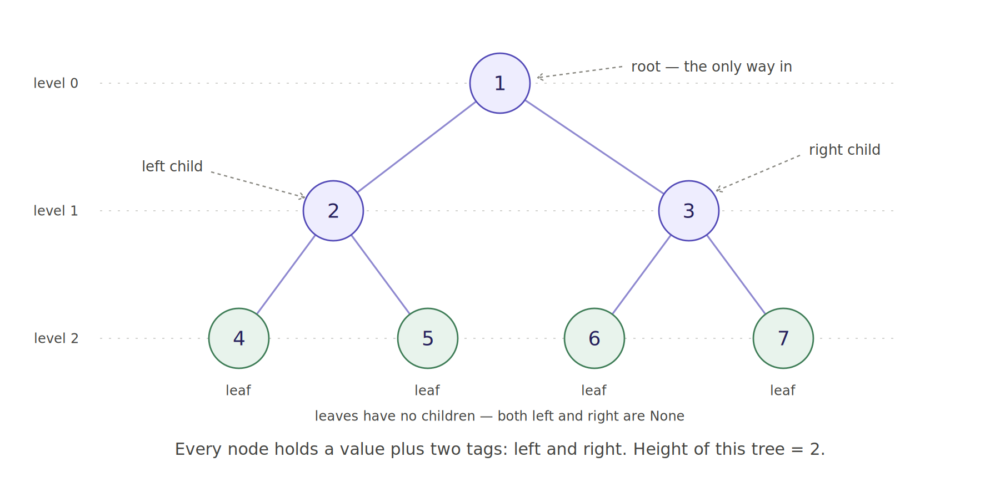
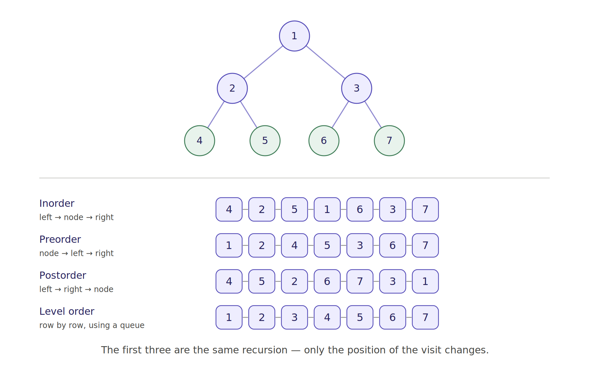

# Binary Trees in Python — Explained Simply

A linked list node had **one** tag (`next`). A binary tree node has **two** — `left` and `right`.

That's the entire difference. Everything else follows from it.

---

## 1. What it looks like



The words you need:

| Word | Meaning |
|---|---|
| **root** | The top node. Your only way into the tree — lose it and you lose everything. |
| **child** | A node hanging below another one. At most two: `left` and `right`. |
| **parent** | The node directly above. |
| **leaf** | A node with no children — both `left` and `right` are `None`. |
| **level / depth** | How many steps down from the root. Root is level 0. |
| **height** | Edges on the longest root-to-leaf path. The tree above has height 2. |
| **subtree** | Any node plus everything below it. A subtree is itself a tree. |

That last row matters more than it looks. **Every subtree is a tree.** That's why recursion works so naturally here — you solve the small version of the same problem.

### The node

```python
class Node:
    def __init__(self, data):
        self.data = data
        self.left = None      # tag to left child, or None
        self.right = None     # tag to right child, or None
```

Same `None`-means-stop convention as the linked list. Same references-not-copies rule too — `root.left = Node(2)` saves node 2's address, exactly like `a.next = b` did.

### Building one by hand

```python
root = Node(1)
root.left = Node(2)
root.right = Node(3)
root.left.left = Node(4)
root.left.right = Node(5)
```

---

## 2. Traversal — the four ways to walk a tree

With a linked list there was only one way to walk: forward. With a tree there are four.



### The three depth-first ones are the same function

This is the single most useful thing to notice. Look at these three side by side:

```python
def inorder(node):
    if node is None: return
    inorder(node.left)
    visit(node)              # <-- MIDDLE
    inorder(node.right)

def preorder(node):
    if node is None: return
    visit(node)              # <-- FIRST
    preorder(node.left)
    preorder(node.right)

def postorder(node):
    if node is None: return
    postorder(node.left)
    postorder(node.right)
    visit(node)              # <-- LAST
```

Identical, except for **where the visit line sits**. Learn one, you have all three.

Names are literal: "pre/in/post" describes when the *node itself* gets visited relative to its children.

| Traversal | When to reach for it |
|---|---|
| **Inorder** | BSTs — it gives you sorted order for free |
| **Preorder** | Copying or serialising a tree (root first, so you can rebuild top-down) |
| **Postorder** | Deleting a tree, or any bottom-up calculation like height |
| **Level order** | Anything about rows, widths, or shortest paths |

### Level order is different: it needs a queue

Depth-first uses a **stack**. Breadth-first uses a **queue**. That's the only structural difference between the two families.

```python
from collections import deque

def level_order(root):
    if root is None:
        return []
    out, q = [], deque([root])
    while q:
        node = q.popleft()        # popleft = FIFO = queue
        out.append(node.data)
        if node.left:  q.append(node.left)
        if node.right: q.append(node.right)
    return out
```

If you want the output grouped by row — `[[1], [2, 3], [4, 5, 6, 7]]` — record `len(q)` *before* the inner loop. That number is exactly how many nodes are on the current level:

```python
while q:
    level_size = len(q)           # <-- capture it FIRST
    for _ in range(level_size):
        ...
```

This one trick unlocks a whole family of interview questions: right-side view, level averages, zigzag traversal, maximum width.

---

## 3. The recursion template that solves half of all tree problems

Most tree questions have the same shape: **ask both children for their answer, then combine.**

```python
def height(node):
    if node is None:                                    # base case
        return -1
    return 1 + max(height(node.left), height(node.right))   # combine

def count_nodes(node):
    if node is None:
        return 0
    return 1 + count_nodes(node.left) + count_nodes(node.right)

def count_leaves(node):
    if node is None:
        return 0
    if node.left is None and node.right is None:
        return 1
    return count_leaves(node.left) + count_leaves(node.right)
```

Three different problems, one shape. When you get a new tree problem, start by asking: *"if my two children handed me their answers, what would I do with them?"*

Note `height` of an empty tree is `-1`, not `0`, because we count **edges**. Some sources count **nodes** and return `0`. Neither is wrong — just say which one you're using in an interview, because the interviewer will have a preference and the off-by-one will otherwise look like a bug.

---

## 4. Binary tree vs Binary SEARCH tree

These are **not** the same thing, and mixing them up is a common interview stumble.

A **binary tree** has no ordering rule. To find a value you must check every node — O(n).

A **binary search tree (BST)** adds one rule:

> everything in the left subtree `<` node `<` everything in the right subtree

That rule lets you throw away half the tree at each step, so search becomes O(log n):

```python
def bst_search(root, target):
    current = root
    while current is not None:
        if target == current.data:
            return True
        current = current.left if target < current.data else current.right
    return False
```

**Every BST is a binary tree. Not every binary tree is a BST.**

### The classic BST trap

To validate a BST, it is **not enough** to check each node against its two children. Look at this:

```
      10
     /
    5
     \
      20
```

Locally everything looks fine: `5 < 10`, and `20 > 5`. But 20 sits in 10's **left** subtree, so it must be less than 10. It isn't. Not a BST.

The fix is to carry a valid range down the recursion:

```python
def is_bst(node, low=float("-inf"), high=float("inf")):
    if node is None:
        return True
    if not (low < node.data < high):
        return False
    return (is_bst(node.left,  low, node.data) and
            is_bst(node.right, node.data, high))
```

Going left tightens the ceiling. Going right raises the floor.

### The BST insight worth memorising

**In-order traversal of a BST gives you sorted order.** Always.

Before coding any BST problem, ask yourself what the in-order traversal looks like. It often hands you the answer directly. "Validate a BST," "find the kth smallest," and "convert BST to a sorted list" are all the same problem wearing different hats.

---

## 5. Why trees, when you have dicts and lists?

| Operation | Python `dict` | Python sorted `list` | Balanced BST |
|---|---|---|---|
| Search | **O(1)** | O(log n) | O(log n) |
| Insert | **O(1)** | O(n) — shifts | **O(log n)** |
| Get items in sorted order | O(n log n) — must sort | **O(n)** | **O(n)** — free |
| Find nearest / range query | Bad | O(log n) | **O(log n)** |

Dicts win on raw lookup. Trees win when you need **order** as well as speed — sorted iteration, "next largest key," range queries. That's why databases use B-trees for indexes and not hash maps.

Honest caveat: like linked lists, you'll rarely hand-roll a BST in production Python. You learn trees because file systems, DOM, JSON, expression parsers, and decision trees are all trees — and because interviews are full of them.

---

## 6. Two traps to remember

**Trap 1 — forgetting the base case.**
Every recursive tree function needs `if node is None:` as its first line. Skip it and you get `AttributeError: 'NoneType' object has no attribute 'left'`. This is the tree equivalent of the linked list `None.next` crash.

**Trap 2 — a degenerate tree.**
Insert `1, 2, 3, 4, 5` into a BST in that order and you get this:

```
1
 \
  2
   \
    3
     \
      4
```

That's a linked list with extra steps. All your O(log n) guarantees become O(n). This is exactly the problem AVL and red-black trees exist to solve — they rebalance on insert.

You should be able to *explain* that in an interview. You almost certainly won't have to implement it: interviews aren't long enough, and experienced engineers report being asked to code self-balancing trees essentially never.

---

## 7. Your turn

In rough order of interview value:

1. **`invert(node)`** — swap `left` and `right` everywhere. Famously short.
2. **`is_balanced(node)`** — true if every node's two subtree heights differ by at most 1. The naive version is O(n²); see if you can do it in one pass.
3. **`lowest_common_ancestor(root, a, b)`** — deepest node with both `a` and `b` below it. Asked constantly at Amazon. Hint: recurse, and if both sides return something, *you* are the answer.
4. **`diameter(node)`** — longest path between any two nodes. It may not pass through the root.
5. **`serialize` / `deserialize`** — turn a tree into a string and back.

Stubs and hints are at the bottom of `binary_tree_basics.py`.

---

## Files

| File | What's in it |
|---|---|
| `binary_tree_basics.py` | All the runnable code — traversals, BST ops, exercises. Run it directly. |
| `binary_tree_anatomy.png` | The vocabulary diagram |
| `binary_tree_traversals.png` | The four traversal orders |
