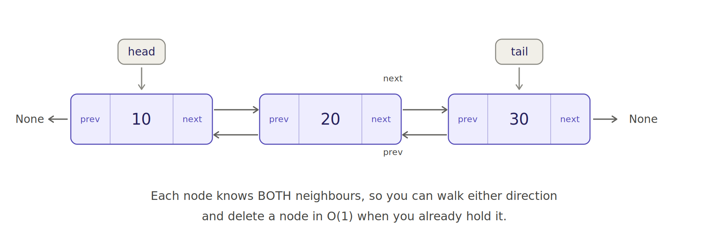
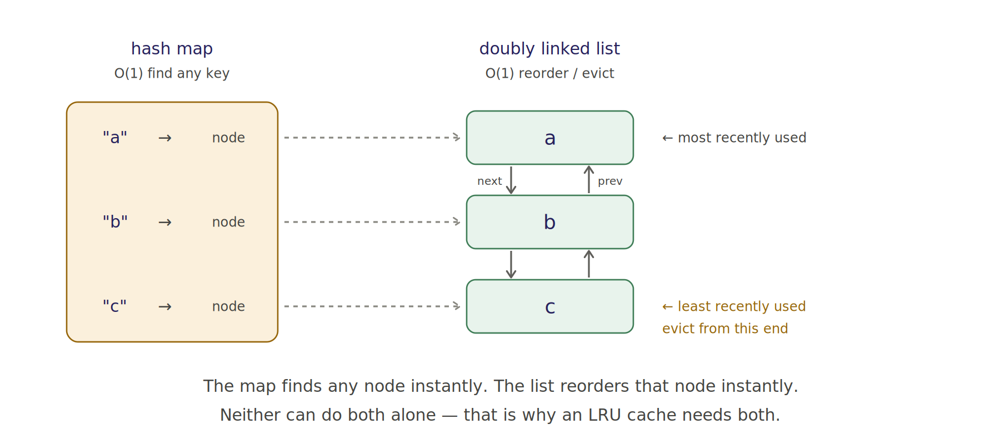

# Doubly Linked Lists in Python — Explained Simply

A singly linked list node had **one** tag: `next`.

A doubly linked list node has **two**: `prev` and `next`.

---

## 1. What it looks like



Each node holds three things now:

```python
class Node:
    def __init__(self, data):
        self.data = data
        self.prev = None      # tag to the previous node, or None if first
        self.next = None      # tag to the next node, or None if last
```

`head.prev` is `None` and `tail.next` is `None`. Both ends are dead ends.

### You pay one extra reference per node. What do you buy?

**1. You can walk backwards.** Start at `tail`, follow `prev`. In a singly list this is impossible without reversing the whole thing first.

**2. You can delete a node in O(1) — if you already hold it.**

That second one is the entire reason this structure exists.

---

## 2. Why O(1) delete is the headline feature

Here's the singly linked list problem. Say you want to delete node `X`:

```
head -> A -> B -> X -> C
             ^
        you need B
```

To remove `X`, someone has to rewire `B.next` to point at `C`. So you need `B`. But holding `X` gives you **no way to reach `B`** — `next` only points forward. You have to walk from `head` until you find the node whose `next` is `X`.

That's **O(n)**, even though you were handed the exact node to delete.

Now the doubly linked version:

```python
X.prev.next = X.next
X.next.prev = X.prev
```

Two lines. **O(1)**. `X` told you who its neighbours are.

### The build-from-scratch warning

Every link has to be set from **both sides**. This is the number one bug in this topic:

```python
a.next = b
b.prev = a        # <-- the line people forget

b.next = c
c.prev = b        # <-- and this one
```

Miss one and your forward traversal works perfectly while your backward traversal silently gives wrong answers. Always test both directions after any modification. The code file does exactly that after every operation, on purpose.

---

## 3. The class

Keeping a `tail` reference next to `head` is what makes `append` O(1). A singly linked list without a tail pointer needs O(n) to append, because it has to walk to the end every time.

```python
class DoublyLinkedList:
    def __init__(self):
        self.head = None
        self.tail = None
        self._size = 0

    def append(self, data):
        """O(1) — because we track the tail."""
        node = Node(data)
        if self.tail is None:              # empty list
            self.head = self.tail = node
        else:
            node.prev = self.tail
            self.tail.next = node
            self.tail = node
        self._size += 1
        return node
```

Notice `append` **returns the node**. That's deliberate — you need a handle on the node to get the O(1) delete later. This is exactly how the LRU cache uses it.

### The remove that handles all four cases at once

A node you want to remove could be the head, the tail, both (single-element list), or in the middle. That looks like it needs a four-branch if-tree. It doesn't:

```python
def remove(self, node):
    if node.prev is not None:
        node.prev.next = node.next
    else:
        self.head = node.next          # node was the head

    if node.next is not None:
        node.next.prev = node.prev
    else:
        self.tail = node.prev          # node was the tail

    node.prev = node.next = None       # detach it fully
    self._size -= 1
```

Handling `prev` and `next` **independently** covers all four cases. The single-element case works because both branches take the `else`, setting `head` and `tail` to `None`.

That last line — detaching the node — isn't strictly required for correctness, but leaving stale pointers on a removed node keeps its old neighbours alive in memory and makes bugs harder to spot.

### What doesn't improve

```python
def find(self, target):     # still O(n)
```

Two-way links help you *move* and *delete*. They do nothing for *searching*. If you need fast lookup, you need a hash map — which is exactly where the next section goes.

---

## 4. LRU Cache — the payoff

This is Amazon's favourite question, and it's the reason to learn doubly linked lists at all.

**The requirement:** `get(key)` and `put(key, value)` both in O(1). When the cache is full, evict the **least recently used** entry.

Neither structure can do this alone:

| | Find a key | Track order | Reorder |
|---|---|---|---|
| Hash map | **O(1)** | no concept of it | — |
| Doubly linked list | O(n) | **yes** | **O(1)** |

So you use **both**, and the map's values are *pointers into the list*.



Convention: **head = most recently used, tail = least recently used.**

- `get(key)` → find the node via the map (O(1)), move it to the front (O(1))
- `put` on an existing key → update the value, move to front
- `put` on a new key when full → the node just before the tail is the victim; unlink it and delete its key from the map

### The sentinel trick

Real implementations use two **dummy nodes** as permanent head and tail:

```python
self.head = LRUNode()        # sentinel, most recent side
self.tail = LRUNode()        # sentinel, least recent side
self.head.next = self.tail
self.tail.prev = self.head
```

They hold no data and are never removed. Because they're always there, **no real node ever has `None` as `prev` or `next`**, which deletes every edge case from your list surgery:

```python
def _unlink(self, node):
    node.prev.next = node.next
    node.next.prev = node.prev
```

No `if node is head`, no `if node is tail`, no empty-list check. Compare that to the four-case `remove` above. This is the trick worth showing in an interview — it signals you've written this code before rather than derived it under pressure.

### The question interviewers use to check you actually understand it

**Why does each node store its own `key`, when the map already maps key → node?**

Because eviction runs in the *other* direction. You start from `tail.prev` — you have the **node**, and you need to delete the matching entry from the map. Without the key stored in the node, you'd have to scan the entire map to find which key points at it, which destroys the O(1) guarantee.

It's a small detail that's very easy to miss and very easy to ask about.

### Verified behaviour

From running `doubly_linked_list_basics.py`:

```
after a,b,c          ['c', 'b', 'a']
get('a') -> 1
'a' is now newest    ['a', 'c', 'b']
put('d') evicts LRU  ['d', 'a', 'c']      <- 'b' is gone
get('b') -> -1
```

Watch what happened: `b` was inserted second, but *touching* `a` pushed `b` to the least-recent end, so `b` got evicted rather than `a`. That's the whole point of "least recently **used**" rather than "oldest inserted."

### One thing to say out loud in an interview

Python has `collections.OrderedDict` with `move_to_end()`, which gives you an LRU cache in about six lines. `functools.lru_cache` exists too.

Mention that you know this, then implement it by hand anyway — they're testing pointer manipulation, not standard-library recall. Volunteering the shortcut *and* writing the long version is a better signal than either alone.

---

## 5. Singly vs doubly — when to use which

| | Singly | Doubly |
|---|---|---|
| Memory per node | 1 reference | 2 references |
| Walk forward | yes | yes |
| Walk backward | no | **yes** |
| Insert at front | O(1) | O(1) |
| Append (with tail ptr) | O(1) | O(1) |
| Delete a node you hold | O(n) | **O(1)** |
| Search | O(n) | O(n) |
| Reverse | O(n), rewire | O(n), or just read backwards |

Use singly by default — it's simpler and lighter. Reach for doubly when you need backward traversal or O(1) deletion of arbitrary nodes. LRU caches, browser history, undo/redo stacks with a cursor, music playlists, and text editor gap buffers are the usual real examples.

`collections.deque` is a doubly linked list of blocks internally. That's why both of its ends are O(1) — and why indexing into its middle isn't.

---

## 6. Your turn

1. **`reverse()`** — swap `prev` and `next` on every node, then swap `head` and `tail`. Shorter than the singly version.
2. **Circular doubly linked list** — `tail.next` points to `head`, `head.prev` points to `tail`, no `None` anywhere. Careful: your traversal condition must change or the loop never ends.
3. **LFU cache** — evict the least *frequently* used. Much harder than LRU; needs a map from frequency to a doubly linked list.
4. **Answer out loud:** why does `LRUCache` store `key` inside the node? (Section 4 has it, but say it in your own words.)

Stubs and hints are at the bottom of `doubly_linked_list_basics.py`.

---

## Files

| File | What's in it |
|---|---|
| `doubly_linked_list_basics.py` | Runnable code — the node, the class, and a full working LRU cache. Run it directly. |
| `images/doubly_linked_list.png` | The structure diagram |
| `images/lru_cache.png` | How the map and the list combine |
