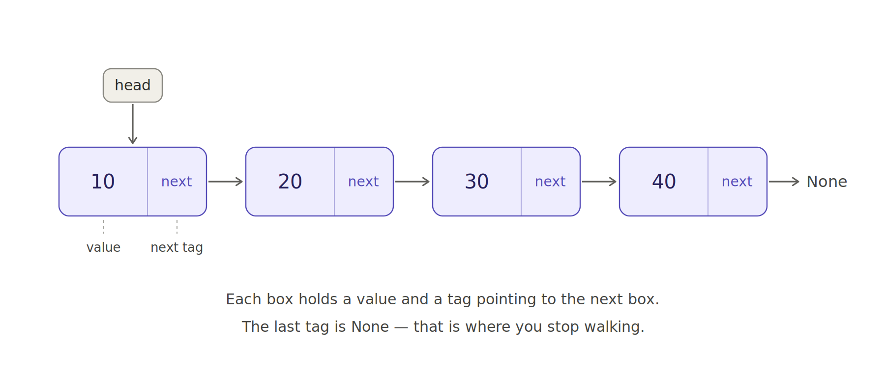
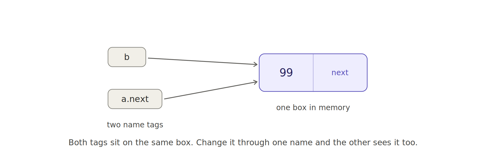

# Linked Lists in Python — Explained Simply

A linked list is just **boxes connected by tags**. Nothing more.

---

## 1. What it looks like



Read the picture like this:

- Every **box** is one node. It has two parts.
- The left part holds the **value** — the actual data (10, 20, 30, 40).
- The right part holds a **tag** that points to the next box.
- The last box's tag is `None`. That means "nothing after me, stop here."
- `head` is a tag pointing at the very first box. It is the only way in.

If you lose `head`, you lose the whole list. There is no other entry point.

---

## 2. The one thing people get confused about

When you write this:

```python
b = Node(20)
a.next = b
```

Python does **not** make a copy of the box. It just puts a second name tag on the same box.



So that box now has two tags on it: `b` and `a.next`. They are two names for **one** thing.

Proof:

```python
b.data = 99
print(a.next.data)   # 99  <- it changed too!
```

There was never a second box to be different. You just looked at the same box through a different name.

**Short answer to "are we saving addresses?"** — Yes, we are. Python just hides the address from you. Every variable in Python is secretly "the address of a box," so you never have to write `&` or `*` like you would in C.

---

## 3. The code

### The box

```python
class Node:
    def __init__(self, data):
        self.data = data
        self.next = None      # tag to the next box, or None if last
```

Two attributes. That is the whole building block.

### Chaining them by hand

```python
a = Node(10)
b = Node(20)
c = Node(30)

a.next = b
b.next = c

head = a
```

### Walking the chain

```python
current = head
while current is not None:
    print(current.data)
    current = current.next
```

This loop is **the** linked list pattern. Almost everything else is a variation of it:

> start at `head` → move with `current = current.next` → stop at `None`

Note that `current = current.next` does not copy or move any box. It just peels the `current` tag off one box and sticks it on the next one. That is why walking a million boxes costs almost nothing in memory.

### Wrapping it in a class

```python
class LinkedList:
    def __init__(self):
        self.head = None

    def append(self, data):
        """Add to the end. O(n) — we must walk to the last box."""
        new_node = Node(data)

        if self.head is None:              # empty list
            self.head = new_node
            return

        current = self.head
        while current.next is not None:    # walk to the LAST box
            current = current.next
        current.next = new_node

    def display(self):
        values = []
        current = self.head
        while current is not None:
            values.append(current.data)
            current = current.next
        print(" -> ".join(map(str, values)), "-> None")
```

Run it:

```python
ll = LinkedList()
ll.append(10)
ll.append(20)
ll.append(30)
ll.display()          # 10 -> 20 -> 30 -> None
```

---

## 4. Two traps to remember

**Trap 1 — the empty list.**
If `head` is `None` there is no box to attach anything to. Handle that case separately or you will crash.

**Trap 2 — the loop condition.**
In `append` it is `current.next is not None`, **not** `current is not None`.

| Condition | Where the loop stops | Result |
|---|---|---|
| `current is not None` | `current` becomes `None` | Crash on `None.next` |
| `current.next is not None` | `current` is the last box | Correct |

This off-by-one is the classic beginner bug. When you want to *read* every box, use the first form. When you want to *attach to* the last box, use the second.

---

## 5. Why bother, when Python already has lists?

| Operation | Python list | Linked list |
|---|---|---|
| Add to front | O(n) — shifts everything | **O(1)** — just one new tag |
| Add to end | O(1) | O(n) — must walk to the end |
| Get item by index | **O(1)** | O(n) — must walk there |
| Memory layout | One solid block | Scattered boxes |

Linked lists win when you add and remove at the **front** a lot. Python lists win almost everywhere else — which is why you will rarely use a linked list in real Python code. You learn it because the pointer thinking shows up everywhere afterwards: trees, graphs, queues, and most interview questions.

---

## 6. Your turn

Write `prepend(data)` — add a new box at the **front** of the list.

It is only two lines, and unlike `append` it is O(1), because you never have to walk anywhere.

```python
def prepend(self, data):
    ...
    ...
```

Hint: the new box's tag should point at the old `head`, and then `head` should move to the new box. Order matters — if you move `head` first, you lose the rest of the chain.
