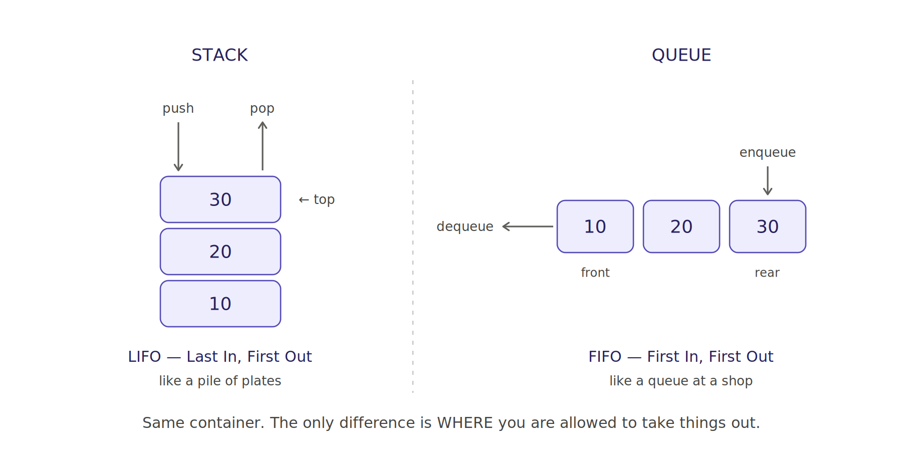

# Stacks and Queues in Python — Explained Simply

Both are just **"a list where you're only allowed to touch the ends."**

The difference is *which* end.

---

## 1. The one picture that explains both



**Stack** — you add and remove at the **same** end. Like a pile of plates: the last plate you put on is the first one you take off. That's **LIFO**, Last In First Out.

**Queue** — you add at one end and remove at the **other**. Like a queue at a shop: first person in line is first served. That's **FIFO**, First In First Out.

That's genuinely the whole concept. Everything below is about doing it *efficiently* in Python, and the problems that use them.

| Word | Stack | Queue |
|---|---|---|
| Add | push | enqueue |
| Remove | pop | dequeue |
| Look without removing | peek / top | front |
| Where things go in | top | rear / back |
| Where things come out | top | front |

---

## 2. Stack

### Just use a list

A Python list **is** a stack. `append()` and `pop()` both work on the end, and both are O(1).

```python
stack = []
stack.append(10)      # push
stack.append(20)
stack.append(30)

stack.pop()           # 30 — the last one in
stack[-1]             # 20 — peek, without removing
len(stack) == 0       # is it empty?
```

In an interview this is the correct answer unless they explicitly ask you to build one from scratch.

### Why write a Stack class then?

Not for speed — for **restriction**. A list lets you do `stack[0]` or insert in the middle. A `Stack` class doesn't. It makes the LIFO rule impossible to break by accident, which matters when the stack is part of a larger algorithm.

```python
class Stack:
    def __init__(self):
        self._items = []

    def push(self, item):
        self._items.append(item)

    def pop(self):
        if self.is_empty():
            raise IndexError("pop from empty stack")
        return self._items.pop()

    def peek(self):
        return self._items[-1]

    def is_empty(self):
        return len(self._items) == 0
```

Always raise on empty rather than returning `None` — otherwise a legitimate `None` value in your stack becomes indistinguishable from "stack is empty."

### A stack is a linked list in disguise

Remember `prepend()` from the linked list lesson? Adding at the head is O(1). A stack is literally **prepend + remove-head**:

```python
def push(self, item):
    node = Node(item)
    node.next = self.head     # new node points at the old top
    self.head = node          # top moves to the new node

def pop(self):
    data = self.head.data
    self.head = self.head.next    # just move head down one
    return data
```

If `prepend` made sense, you already understand a stack. This is why the two topics belong next to each other.

---

## 3. Queue

### The trap: never use a list as a queue

This is the single most important thing on this page.

```python
q = [1, 2, 3]
q.pop(0)          # WRONG — this is O(n)
```

`pop(0)` removes from the front, which forces Python to shift **every remaining element** left by one. Draining a queue of n items that way costs O(n²).

Use `collections.deque`, which is a doubly linked list internally, so both ends are O(1):

```python
from collections import deque

q = deque()
q.append(10)      # enqueue at the rear — O(1)
q.popleft()       # dequeue at the front — O(1)
q[0]              # front, without removing
```

The difference isn't theoretical. Measured in `stack_queue_basics.py` at n=60,000:

```
list.pop(0)     0.2695s
deque.popleft() 0.0012s
deque is ~220x faster
```

Run it yourself and watch the gap widen as you raise n. That's O(n²) vs O(n) in front of you.

### Naming that trips people up

`deque` is pronounced "deck" — short for **d**ouble-**e**nded **que**ue. It works as both a stack *and* a queue, since all four operations (`append`, `pop`, `appendleft`, `popleft`) are O(1).

So why use a plain list for stacks at all? Lists have less overhead and better cache locality for pure stack use. For queues, deque isn't optional.

---

## 4. Queue from two stacks

A classic interview question. Two LIFOs make a FIFO.

Push onto `inbox`. When you need to dequeue, tip the whole inbox into `outbox` — that **reverses** the order — then pop from `outbox`.

```python
def enqueue(self, item):
    self._inbox.append(item)

def dequeue(self):
    if not self._outbox:                 # only refill when empty
        while self._inbox:
            self._outbox.append(self._inbox.pop())   # reverses
    return self._outbox.pop()
```

The interesting part is the cost. A single `dequeue` can be O(n) when it has to tip everything over. But each item is moved between the stacks **at most once** in its lifetime, so the *amortised* cost is O(1).

The line that makes this work is `if not self._outbox`. Refilling only when the outbox is empty is what keeps items from being moved twice. If you tip on every dequeue, you're back to O(n) per operation. Interviewers watch for exactly this.

---

## 5. What they're actually for

### Stack → "most recent" problems

Whenever a problem says **most recent**, **innermost**, **undo**, or **matching pairs**, that's a stack.

**Balanced brackets** (LeetCode 20, asked essentially everywhere):

```python
def is_balanced(s):
    pairs = {")": "(", "]": "[", "}": "{"}
    stack = []
    for ch in s:
        if ch in "([{":
            stack.append(ch)
        elif ch in pairs:
            if not stack or stack.pop() != pairs[ch]:
                return False
    return not stack      # leftover openers means unbalanced
```

A closer must match the *most recent* unmatched opener. "Most recent" is the word that tells you which structure to reach for.

Don't forget the `return not stack` at the end. `"(("` has no mismatch — it just never closes. Returning `True` there is the standard bug.

Other stack uses: undo/redo, browser back button, function call stacks, expression evaluation, iterative DFS, monotonic-stack problems.

### Queue → "in order" and "level by level" problems

**BFS** is the big one. Level-order traversal from the binary tree lesson is the same algorithm:

```python
def bfs_shortest_path(graph, start, goal):
    visited = {start}
    q = deque([[start]])            # queue of paths
    while q:
        path = q.popleft()
        for neighbour in graph.get(path[-1], []):
            if neighbour in visited:
                continue
            if neighbour == goal:
                return path + [neighbour]
            visited.add(neighbour)
            q.append(path + [neighbour])
    return None
```

BFS finds the **shortest** path in an unweighted graph, and DFS doesn't. That's not a small detail — it's the reason the choice of stack vs queue matters. Same code, swap the queue for a stack, and you get depth-first with no shortest-path guarantee.

Other queue uses: task scheduling, rate limiting, producer/consumer buffers, print spoolers.

---

## 6. Complexity summary

| Operation | list as stack | deque | list as queue |
|---|---|---|---|
| Add to end | **O(1)** | **O(1)** | O(1) |
| Remove from end | **O(1)** | **O(1)** | O(1) |
| Add to front | O(n) | **O(1)** | O(n) |
| Remove from front | O(n) | **O(1)** | **O(n)** ← the trap |
| Access by index | O(1) | O(n) | O(1) |

Note the last row: `deque` indexing in the middle is O(n), because it's a linked structure. If you need random access *and* fast ends, you need a different design.

---

## 7. Your turn

In rough order of interview value:

1. **`min_stack`** — a stack with `push`, `pop`, and `get_min()` all O(1). Hint: keep a *second* stack of minimums alongside the main one.
2. **`next_greater_element(nums)`** — for each element, the next bigger element to its right. This is the **monotonic stack** pattern and it shows up constantly.
3. **`stack_from_two_queues`** — the mirror image of section 4.
4. **`sliding_window_maximum(nums, k)`** — max of every window of size k, in O(n). Hint: a deque holding *indices*, kept in decreasing order of value. Genuinely hard, genuinely common.

Number 1 is the best use of your next 20 minutes. Number 4 is where deque stops being a convenience and becomes the actual algorithm.

Stubs and hints are at the bottom of `stack_queue_basics.py`.

---

## Files

| File | What's in it |
|---|---|
| `stack_queue_basics.py` | Runnable code — both structures, four implementations, the timing demo, and the applications. Run it directly. |
| `images/stack_vs_queue.png` | The LIFO vs FIFO diagram |
